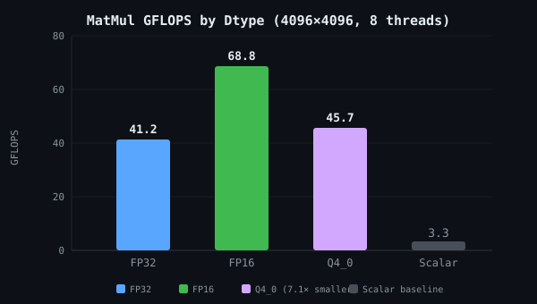
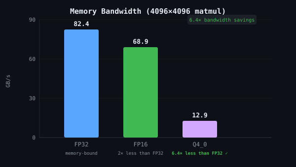
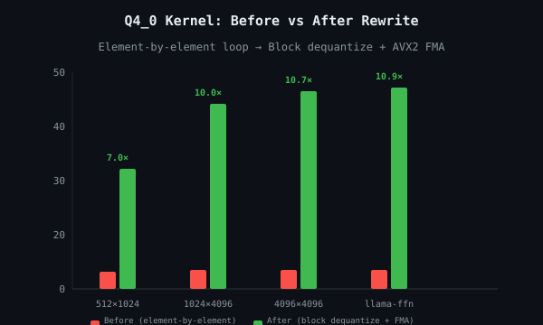

# 🌀 Hypno

<p align="center">
  <strong>Run LLMs on your machine. No Python. No CUDA. Just Rust.</strong>
</p>

<p align="center">
  
  
  
  
</p>

---

Hypno is a pure-Rust inference engine for large language models. It reads HuggingFace checkpoints, bakes them into a compact `.hypno` binary, and runs inference on your CPU — with hand-tuned SIMD kernels that auto-dispatch for whatever silicon you're on.

No PyTorch. No ONNX. No llama.cpp bindings. Just one static binary that loads models in under a millisecond and saturates every core.

---

## Why

Because `pip install torch` shouldn't be a prerequisite for running a transformer. Because AVX-512 registers have been sitting unused since 2017. Because reading a file from disk should not take 3 seconds when `mmap` exists.

Hypno is built around a few sharp edges:

| Edge | Payoff |
|---|---|
| Memory-mapped model files | Loads in **&lt;1 ms** — the OS pages in what you need |
| Runtime CPU feature detection | One binary, auto-dispatching AVX-512 → AVX2 → SSE4.1 → scalar |
| Q4_0 quantization with SIMD dequantize | 7.1× smaller on disk, **faster matmul than FP32** |
| Single static binary + Docker image | ~10 MB binary, ~50 MB container |
| LoRA merging built into the converter | `--lora-dir` merges adapters into base weights before quantizing |

---

## Performance

Run `cargo bench` (or `hypno-bench`) to see numbers for your machine. Here's what we get on an AVX-512 CPU with 8 threads:

<p align="center">
  
  
</p>

### Quantization

| Method | Bits/element | Compression | MAE (accuracy loss) |
|---|---|---|---|
| FP32 | 32 | 1.0× | 0 (reference) |
| FP16 | 16 | 2.0× | &lt; 0.001 |
| Q8_0 | 8.5 | ~3.8× | ~0.001 |
| **Q4_0** | **4.5** | **7.1×** | **0.033** |

A 7B model goes from ~14 GB FP32 → ~2 GB Q4_0 on disk. You can run it on a laptop.

### Q4_0 kernel evolution

<p align="center">
  
</p>

The original element-by-element loop walked every nibble and checked `if row == current_row` — 128× redundant work per row. The rewrite dequantizes each block once into a stack buffer and computes the dot product with 4 × 8-wide AVX2 FMA. Zero per-element branching.

---

## Getting started

```bash
git clone https://github.com/HypnotizerAI/hypno.git
cd hypno
cargo build --release
```

That's it. You now have `hypno-cli` and `hypno-convert` in `target/release/`.

### Convert a model

```bash
# Download a model first
huggingface-cli download TinyLlama/TinyLlama-1.1B-Chat-v1.0 --local-dir ./tinyllama

# FP32 — lossless
hypno-convert --model-dir ./tinyllama --out model.hypno

# FP16 — half size, imperceptible loss
hypno-convert --model-dir ./tinyllama --out model-fp16.hypno --quantize FP16

# Q4_0 — 7× smaller, still surprisingly good
hypno-convert --model-dir ./tinyllama --out model-q4.hypno --quantize Q4_0
```

### Merge a LoRA adapter

```bash
# Convert just the adapter (standalone)
hypno-convert --lora-only ./my-fine-tune --out adapter.hypno

# Merge LoRA into base model, then quantize
hypno-convert \
    --model-dir ./llama-2-7b \
    --lora-dir ./my-fine-tune \
    --quantize Q4_0 \
    --out llama-merged-q4.hypno
```

### Chat

```bash
# One-shot
hypno-cli --model model.hypno --prompt "Explain monads" --max-tokens 128

# Interactive session
hypno-cli --model model.hypno --temperature 0.7 --top-p 0.95

# Set a custom system prompt
hypno-cli --model model.hypno --system "You are a Rust expert. Use code examples."
```

### Docker

```bash
docker compose up -d
docker compose exec hypno hypno-cli --model /models/model.hypno
```

---

## How it works

### The `.hypno` format

```
┌──────────────┬─────────────────┬──────────────────┬──────────────────┐
│ Header (16B) │ Metadata KVs    │ Tensor Table     │ Aligned Data     │
│ HYPN + v1    │ config, vocab,  │ per-tensor:      │ all payloads at  │
│              │ tokenizer JSON  │ name, shape,    │ 64-byte offsets  │
│              │                 │ dtype, offset    │ for direct loads │
└──────────────┴─────────────────┴──────────────────┴──────────────────┘
```

- Magic bytes `HYPN` + version u32 LE
- Tensor data is 64-byte aligned — load directly into `__m256`/`__m512` registers, no copies
- Small tensors (&le;4096 elements, mostly layernorms and biases) auto-stay FP32 even when quantizing
- Tokenizer vocabulary is embedded — no separate `tokenizer.json` at runtime

### Inference pipeline

```
.hypno file ──mmap──▶ zero-copy tensor access      (hypno-loader)
                           │
                    ┌──────▼──────┐
                    │  Tokenizer  │                 (hypno-tokenizer)
                    │  BPE encode │  prompt → [token IDs]
                    └──────┬──────┘
                           │
                    ┌──────▼──────┐
                    │  Embedding  │                 (hypno-inference)
                    └──────┬──────┘
                           │
              ┌────────────▼────────────┐
              │  Transformer × N layers │
              │  RMSNorm → Attention    │
              │    (RoPE, GQA, KV cache)│
              │  → FFN (SiLU gate)      │
              │  → residual add         │
              └────────────┬────────────┘
                           │
                    ┌──────▼──────┐
                    │  LM head    │
                    │  + sampling │  top-p / top-k / temperature
                    └──────┬──────┘
                           │
                    decoded text
```

### SIMD dispatch

Every kernel checks CPUID at startup and picks the best path:

```rust
// Runtime dispatch — no compile-time feature flags
pub fn matmul_f32(y: &mut [f32], w: &[f32], x: &[f32], bias: Option<&[f32]>, n: usize, m: usize) {
    if cpu_features().avx512f {
        unsafe { matmul_f32_avx512(y, w, x, bias, n, m) }
    } else if cpu_features().avx2 && cpu_features().fma {
        unsafe { matmul_f32_avx2(y, w, x, bias, n, m) }
    } else if cpu_features().sse4_1 {
        unsafe { matmul_f32_sse41(y, w, x, bias, n, m) }
    } else {
        matmul_f32_scalar(y, w, x, bias, n, m)
    }
}
```

One binary, every x86_64 CPU from 2013 onward. ARM NEON on Apple Silicon works the same way.

---

## Project structure

```
hypno/
├── crates/
│   ├── hypno-core/          # .hypno binary format + dtypes
│   ├── hypno-convert/       # safetensors → .hypno + LoRA merge
│   ├── hypno-loader/        # zero-copy mmap reader
│   ├── hypno-inference/     # transformer + SIMD kernels
│   ├── hypno-quantize/      # Q4_0/Q8_0 encode/decode
│   ├── hypno-tokenizer/     # BPE from tokenizer.json
│   ├── hypno-cli/           # interactive chat CLI
│   └── hypno-bench/         # GFLOPS benchmark harness
├── benchmarks/              # SVG performance charts
├── tests/
│   └── e2e_test.py          # end-to-end: synthetic model → convert → infer
├── Dockerfile               # multi-stage, ~50 MB image
├── docker-compose.yml
└── README.md
```

---

## Platforms

| OS | Architecture | SIMD path | Status |
|---|---|---|---|
| **Linux** | x86_64 | AVX-512, AVX2, SSE4.1 | ✅ primary |
| **macOS** | x86_64 | AVX2, SSE4.1 | ✅ |
| **macOS** | ARM64 (Apple Silicon) | NEON | ✅ |
| **Windows** | x86_64 | AVX-512, AVX2, SSE4.1 | ✅ |

---

## Requirements

- Rust 1.80+
- Any x86_64 or ARM64 CPU

That's the whole list.

---

## License

[Apache 2.0](LICENSE-APACHE)
